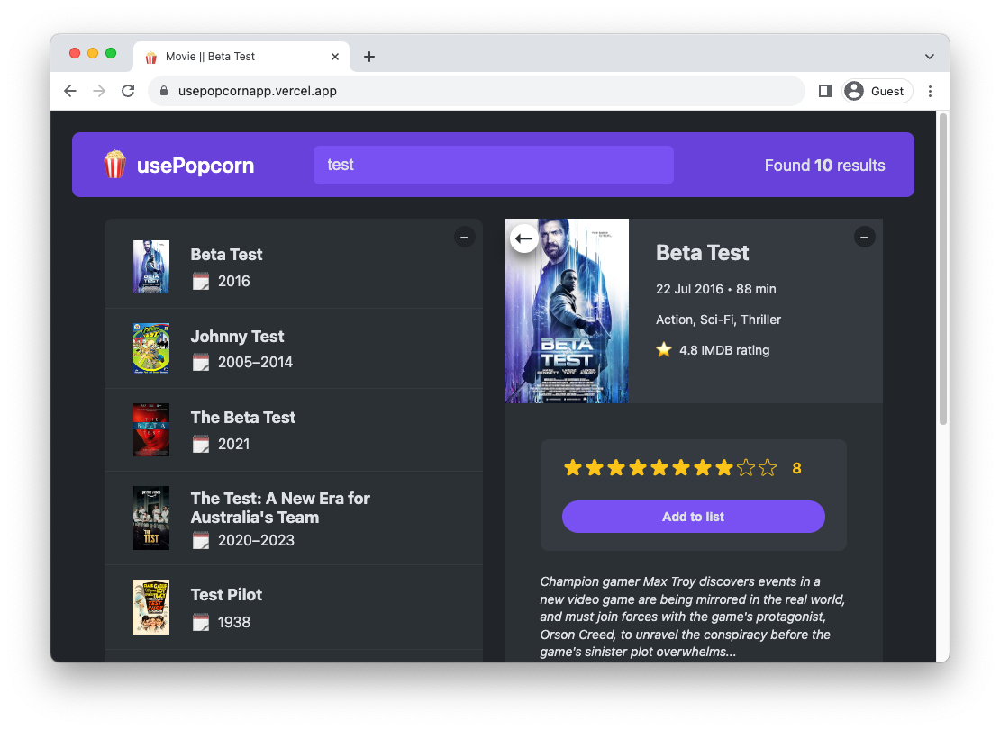
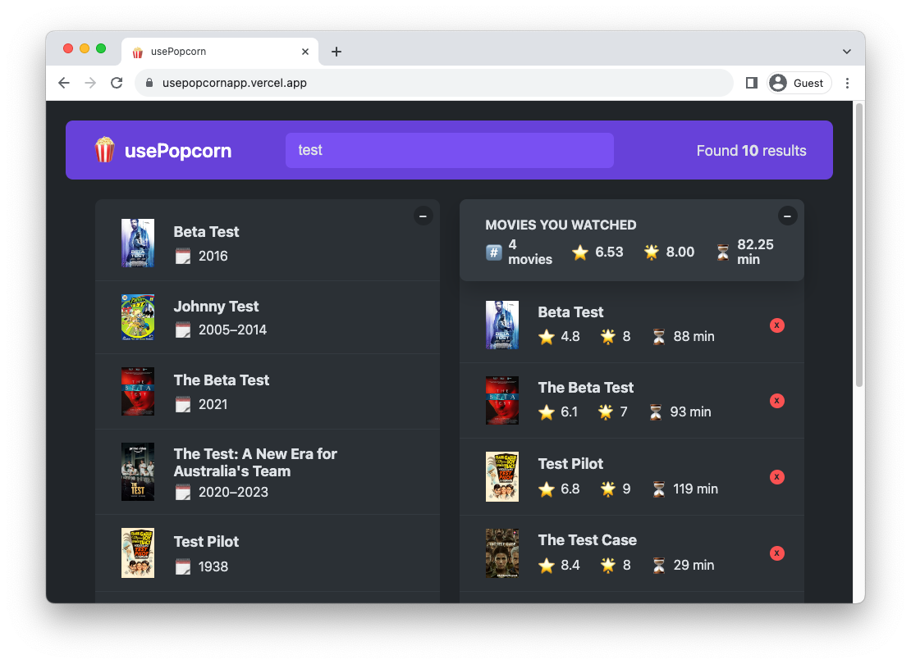

# usePopcorn - A Movie Watchlist React App

**usePopcorn** is a React-based web application that allows you to search for movies, view their details, rate them, and keep track of the movies you've watched. It provides an interactive interface for movie enthusiasts to discover and manage their favorite films.

## Demo

[usePopcorn](https://usepopcornapp.vercel.app/)

## Screenshots

## Features

- Search for movies by title.
- View detailed information about a movie, including its title, year, poster, IMDb rating, and more.
- Rate movies and add them to your watched list.
- Keep track of the movies you've watched, including IMDb and user ratings, runtime, and more.
- Easily delete movies from your watched list.

## Technologies Used

- React
- OMDB API for movie data
- Hooks like useState, useEffect, and useRef
- Custom React hooks for state management
- CSS for styling
